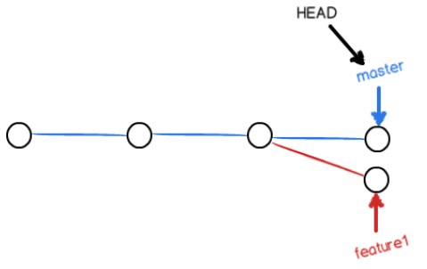
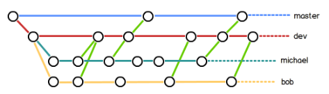

## git教程

安装git

自报家门

```
$ git config --global user.name "Your Name"
$ git config --global user.email "email@example.com"
```

## 本地仓库

### 创建一个新的git本地仓库的步骤

1. 创建一个当做git仓库的文件夹，eg: 在e盘根目录创建git_文件夹

2. 打开git bash命令行窗口，进入到git仓库路径—— cd   /e/git_

3. 通过`git init`命令把这个目录变成Git可以管理的仓库。(瞬间Git就把仓库建好了，而且告诉你是一个空的仓库（empty Git repository），细心的读者可以发现当前目录下多了一个`.git`的目录，这个目录是Git来跟踪管理版本库的，没事千万不要手动修改这个目录里面的文件，不然改乱了，就把Git仓库给破坏了。如果你没有看到`.git`目录，那是因为这个目录默认是隐藏的，用`ls -ah`命令就可以看见。)

注：

使用Windows的童鞋要特别注意：

**千万不要使用Windows自带的记事本编辑任何文本文件。**原因是Microsoft开发记事本的团队使用了一个非常弱智的行为来保存UTF-8编码的文件，他们自作聪明地在每个文件开头添加了0xefbbbf（十六进制）的字符，你会遇到很多不可思议的问题，比如，网页第一行可能会显示一个“?”，明明正确的程序一编译就报语法错误，等等，都是由记事本的弱智行为带来的。建议你下载[Notepad++](http://notepad-plus-plus.org/)代替记事本，不但功能强大，而且免费！记得Notepad++的默认编码设置为UTF-8 without BOM即可

### 在本地仓库添加并提交文件

```php
1.先把本次要提交的文件放到本地仓库文件夹内
2.git bash进入到本地仓库路径下，使用git add XXX 命令添加要提交的文件，添加完后使用git commit -m "相关描述" 来完成提交
    
$ git add JS_notebook.pdf  或者 git add .
$ git commit -m "js笔记"
```

### 查看仓库当前状态

```
git status

要随时掌握工作区的状态，使用git status命令。
如果git status告诉你有文件被修改过，用git diff可以查看修改内容。
```

### 版本回退

```
git log   |   git log --pretty=online

显示从最近到最远的提交日志,大串字符为commit id
1094adb7b9b3807259d8cb349e7df1d4d6477073 (HEAD -> master) append GPL
e475afc93c209a690c39c13a46716e8fa000c366 add distributed
eaadf4e385e865d25c48e7ca9c8395c3f7dfaef0 wrote a readme file

git reset --hard HEAD^
回退到上一版本

git reset --hard commitid前几位
回退到指定版本

git reflog记录使用者的每一次命令

总结：
HEAD指向的版本就是当前版本，因此，Git允许我们在版本的历史之间穿梭，使用命令git reset --hard commit_id。

穿梭前，用git log可以查看提交历史，以便确定要回退到哪个版本。

要重返未来，用git reflog查看命令历史，以便确定要回到未来的哪个版本。
```

### 工作区和暂存区

```
工作区（Working Directory）就是你在电脑里能看到的目录

把文件往Git版本库里添加的时候，是分两步执行的：
第一步是用git add把文件添加进去，实际上就是把文件修改添加到暂存区；
第二步是用git commit提交更改，实际上就是把暂存区的所有内容提交到当前分支。

可以简单理解为，需要提交的文件修改通通放到暂存区，然后，一次性提交暂存区的所有修改。

git管理的是修改而不是文件
```

### 撤销修改

```
git checkout --file
让这个文件回到最近一次git commit或git add时的状态

用命令git reset HEAD <file>可以把暂存区的修改撤销掉（unstage），重新放回工作区
丢弃工作区的修改 git checkout --file

git checkout其实是用版本库里的版本替换工作区的版本，无论工作区是修改还是删除，都可以“一键还原”。
```

### 在本地仓库删除文件

```
$ git rm JS_notebook.pdf
$ git commit -m "delete JS笔记"
```

**注意：**

每次在本地仓库添加或者删除文件后，一定要commit，否则会造成仓库 工作区 和 版本库 不一致的问题。可以通过查看git仓库的状态来看异常，使用 git status 命令

## 远程仓库

### 将某个本地仓库与github关联实现同步

```
git remote add origin '你github上的仓库地址'

添加后，远程库的名字就是origin，这是Git默认的叫法，也可以改成别的，但是origin这个名字一看就知道是远程库。
```

### 本地提交后通过 git push origin master 推送最新修改

```
git push -u origin master
把本地库的内容推送到远程，用git push命令，实际上是把当前分支master推送到远程。
由于远程库是空的，我们第一次推送master分支时，加上了-u参数，Git不但会把本地的master分支内容推送的远程新的master分支，还会把本地的master分支和远程的master分支关联起来，在以后的推送或者拉取时就可以简化命令。

从现在起，只要本地作了提交，就可以通过命令：git push origin master
```

#### 小结

```
要关联一个远程库，使用命令git remote add origin 'github仓库地址'；

关联后，使用命令git push -u origin master第一次推送master分支的所有内容；

此后，每次本地提交后，只要有必要，就可以使用命令git push origin master推送最新修改；
```

### 从远程库clone

**假设我们从零开发，那么最好的方式是先创建远程库，然后，从远程库克隆。**

git clone命令

## 分支管理

```
查看分支：git branch

创建分支：git branch <name>

切换分支：git checkout <name>或者git switch <name>

创建+切换分支：git checkout -b <name>或者git switch -c <name>

合并某分支到当前分支：git merge <name>

删除分支：git branch -d <name>
```

#### 解决冲突



这种情况下，Git无法执行“快速合并”，只能试图把各自的修改合并起来，但这种合并就可能会有冲突。`git status`也可以告诉我们冲突的文件


当Git无法自动合并分支时，就必须首先解决冲突。解决冲突后，再提交，合并完成。

解决冲突就是把Git合并失败的文件手动编辑为我们希望的内容，再提交。

用`git log --graph`命令可以看到分支合并图。

#### 分支策略



首先，`master`分支应该是非常稳定的，也就是仅用来发布新版本，平时不能在上面干活；

你和你的小伙伴们每个人都在`dev`分支上干活，每个人都有自己的分支，时不时地往`dev`分支上合并就可以了。

开发一个新feature，最好新建一个分支（从你当前工作的分支上新建分支，比如lqy分支）；

如果要丢弃一个没有被合并过的分支，可以通过`git branch -D <name>`强行删除。

#### bug分支

修复bug时，我们会通过创建新的bug分支进行修复，然后合并，最后删除；

当手头工作没有完成时，先把工作现场`git stash`一下，然后去修复bug，修复后，再`git stash pop`，回到工作现场；

在master分支上修复的bug，想要合并到当前dev分支，可以用`git cherry-pick <commit>`命令，把bug提交的修改“复制”到当前分支，避免重复劳动。

#### 分支推送

- `master`分支是主分支，因此要时刻与远程同步；
- `dev`分支是开发分支，团队所有成员都需要在上面工作，所以也需要与远程同步；
- bug分支只用于在本地修复bug，就没必要推到远程了，除非老板要看看你每周到底修复了几个bug；
- feature分支是否推到远程，取决于你是否和你的小伙伴合作在上面开发。

#### 多人协作

多人协作的工作模式通常是这样：

1. 首先，可以试图用`git push origin <branch-name>`推送自己的修改；
2. 如果推送失败，则因为远程分支比你的本地更新，需要先用`git pull`试图合并；
3. 如果合并有冲突，则解决冲突，并在本地提交；
4. 没有冲突或者解决掉冲突后，再用`git push origin <branch-name>`推送就能成功！

如果`git pull`提示`no tracking information`，则说明本地分支和远程分支的链接关系没有创建，用命令`git branch --set-upstream-to <branch-name> origin/<branch-name>`。

#### rebase

- rebase操作可以把本地未push的分叉提交历史整理成直线；
- rebase的目的是使得我们在查看历史提交的变化时更容易，因为分叉的提交需要三方对比。

注意：如果Pull了以后是同一个文件冲突，先解决冲突再rebase后冲突又恢复了。因此要先将冲突文件执行git add . 和 git commit -m 'xxx'，再执行git rebase，在执行git rebase 时终端提示：Resolve all conflicts manually, mark them as resolved with "git add/rm <conflicted_files>", then run "git rebase --continue”。这时再手动修改代码解决冲突，执行git add . 再执行 git rebase --continue 就有效果了。这时直接git push 到远程仓库即可。

## 标签管理

发布一个版本时，我们通常先在版本库中打一个标签（tag），这样，就唯一确定了打标签时刻的版本。将来无论什么时候，取某个标签的版本，就是把那个打标签的时刻的历史版本取出来。所以，标签也是版本库的一个快照。

Git的标签虽然是版本库的快照，但其实它就是指向某个commit的指针（跟分支很像对不对？但是分支可以移动，标签不能移动），所以，创建和删除标签都是瞬间完成的。

tag就是一个让人容易记住的有意义的名字，它跟某个commit绑在一起。

- 命令`git tag <tagname>`用于新建一个标签，默认为`HEAD`，也可以指定一个commit id；
- 命令`git tag -a <tagname> -m "blablabla..."`可以指定标签信息；
- 命令`git tag`可以查看所有标签。


- 命令`git push origin <tagname>`可以推送一个本地标签；
- 命令`git push origin --tags`可以推送全部未推送过的本地标签；
- 命令`git tag -d <tagname>`可以删除一个本地标签；
- 命令`git push origin :refs/tags/<tagname>`可以删除一个远程标签。

### 重要：将本地项目上传到github

- **在github上新建一个仓库，clone到本地**

```
1. 在github上新建一个仓库，勾选上Initialize this repository with a README
2. 用git bash进入本地想要clone的目标文件夹的上层文件夹,使用git clone address命令，address是github为我们生成的。
3. 然后在本地就会出现clone下来的文件夹，git bash进入此文件夹，运行 git add . 命令
4. 运行 git commit -m "discription"命令
5. 运行git push -u origin master命令
```

- **先在本地创建版本库，再上传到github**

```
1. 我们需要先创建一个本地的版本库（其实也就是一个文件夹）。git bash进入到此文件夹路径下
2. 通过命令git init把这个文件夹变成Git可管理的仓库
3. 把项目粘贴到这个本地Git仓库里面（粘贴后你可以通过git status来查看你当前的状态），然后通过git add .把项目添加到仓库
4. 用git commit把项目提交到仓库。
5. 在Github上创建一个Git仓库。之后我们就可以和本地仓库进行关联_ git remote add origin address
6. 关联好之后我们就可以把本地库的所有内容推送到远程仓库（也就是Github）上了，通过：git push -u origin master 命令
由于新建的远程仓库是空的，所以要加上-u这个参数，等远程仓库里面有了内容之后，下次再从本地库上传内容的时候只需下面这样就可以了：git push origin master
```

